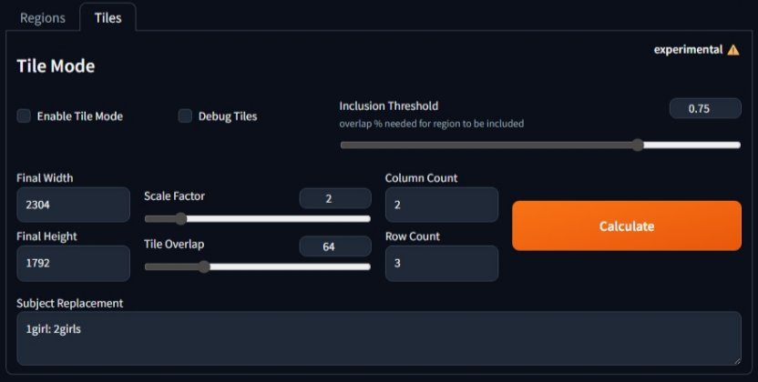

# SD Forge Attention Couple
This is an Extension for the Forge Webui, which allows you to ~~generate couples~~ target different conditionings at specific regions. No more color bleeds or mixed features!

> Support [Forge Classic](https://github.com/Haoming02/sd-webui-forge-classic/tree/classic) / [Forge Neo](https://github.com/Haoming02/sd-webui-forge-classic/tree/neo)

## Showcase
> Trying to generate "jesus christ arguing with santa claus"

<table>
  <thead align="center">
    <tr>
      <th><b>with</b> Forge Couple</th>
      <th><b>without</b> Forge Couple</th>
    </tr>
  </thead>
  <tbody align="center">
    <tr>
      <td>
        <br />Distinct and separate characters
      </td>
      <td>
        <br />Features mixed between characters
      </td>
    </tr>
  </tbody>
</table>

## How to Use

> [!IMPORTANT]
> Only **SD1** and **SDXL** are supported

> [!CAUTION]
> The effectiveness of this Extension depends on how well the Checkpoint follows the prompts<br>
> If the Checkpoint does not understand the composition to begin with, it will not generate the desired result accurately

> [!TIP]
> As shown in the various examples, it is recommended to still prompt for the total amount of subjects first within every region

<details open>
<summary><h4>Index</h4></summary>

- [Basic Mode](#basic-mode)
    - [Tile Direction](#tile-direction)
- [Advanced Mode](#advanced-mode)
- [Mask Mode](#mask-mode)
- Misc.
    - [Global Effect](#global-effect)
    - [Compatibility](#compatibility-toggle)
    - [Separator](#couple-separator)
    - [Common Prompts](#common-prompts)
    - [LoRA](#lora-support)
- [Tile Mode](#tile-mode)
- [API](https://github.com/Haoming02/sd-forge-couple/wiki/API)
- [FAQ](#troubleshooting)

</details>

<br><hr><br>

### Basic Mode

The **Basic** mode works by dividing the image into multiple "tiles" where each tile corresponds to a "**[line](#couple-separator)**" of the positive prompt. Simply prompt more lines to configure more regions.

#### Tile Direction

For the **Basic** mode, you can choose to divide the image into columns or rows:

- **Horizontal:** Each line maps to regions from `left` to `right`
- **Vertical:** Each line maps to regions from `top` to `bottom`

<p align="center">
<br>
<code>Horizontal</code> <b>Direction</b>
</p>

```
2girls, blonde twintails, cyan eyes, white serafuku, standing, waving, looking at viewer, smile
2girls, black long hair, red eyes, dark school uniform, standing, crossed arms, looking away
```

<p align="center">
<br>
<code>Vertical</code> <b>Direction</b>
</p>

```
galaxy, stars, milky way
blue sky, clouds
sunrise, lens flare
ocean, waves
beach, sand
```

<br>

> [!NOTE]
> Most use cases can be achieved simply with the **Basic** mode... Stop overcomplicating things for no reason...

<br><hr><br>

### Advanced Mode

The **Advanced** mode allows you to manually specify the coordinates and sizes of each region

> [!IMPORTANT]
> The entire image **must** contain weights

- **Entries:**
    - Each row contains a range for **x** axis, a range for **y** axis, a **weight**, as well as the corresponding **line** of prompt
        - **x** axis is from `left` to `right`
        - **y** axis is from `top` to `bottom`
    - The range should be within `0.0` ~ `1.0`, representing the **percentage** of the full width/height *(**e.g.** `0.0` to `1.0` would span across the entire axis)*
    - The weight is capped between `0.0` ~ `5.0`
    - *(the actual generation is still based on the main prompt field, in case it went out of sync)*

> [!TIP]
> The mappings are not sent when using the `Send to img2img` function, click the `Pull from txt2img` to manually transfer the mappings

- **Control:**
    - Click on a row to select it, highlighting its bounding box
        - Click on the same row again to deselect it
    - When a row is selected, click the `🆕` button above / below to insert a new row above / below
        - If holding `Shift`, it will also insert a new empty line to the prompts
    - When a row is selected, click the `❌` button to delete it
        - If holding `Shift`, it will also **delete** the corresponding line of prompt
    - Click the `Default Mapping` button to reset the mappings

- **Presets:**
    - You can save the current mapping data, and load them again in the future

- **Draggable Region:**
    - When a bounding box is highlighted, simply drag the box around to reposition the region; drag the edges / corners to resize the region

- **Background:**
    - Click the `📂` button to load an image as the background for reference
    - Click the `⏏` button to load the **img2img** input image as the background
    - Click the `🗑` button to clear the background

<p align="center">
<br>
<b>Advanced</b> Mode UI
</p>

<p align="center">
<br>
<b>Advanced</b> Mode Result
</p>

```
a cinematic photo of a couple, from side, outdoors
couple photo, man, black tuxedo
couple photo, woman, white dress
wedding photo, holding flower bouquet together
sunset, golden hour, lens flare
```

<br><hr><br>

### Mask Mode

The **Mask** mode allows you to manually draw each region

> [!IMPORTANT]
> The entire image **must** contain weights

- **Canvas:**
    - Click the **Create Empty Canvas** button to generate a blank canvas to draw on
    - Only **pure white** `(255, 255, 255)` pixels count towards the mask, other colors are simply discarded
        - This also means you can use other colors as the "eraser"
    - Click the **Save Mask** button to save the image as a new layer of masks
    - When a layer is selected:
        - Click **Load Mask** to load the mask into canvas
        - Click **Override Mask** to save the image and override the selected layer of mask
    - Click the **Reset All Masks** button to clear all the data

> [!NOTE]
> The masks are not sent when using the `Send to img2img` function, click the `Pull from txt2img` to manually transfer the masks *(the `weights` are not sent...)*

- **Entries:**
    - Each row contains a **preview** of the layer, the corresponding **line** of prompt, and the **weight** for the layer
        - *(the actual generation is still based on the main prompt field, in case it went out of sync)*
    - Click on the preview image to <b>select</b> the layer
    - Click the arrow buttons to re-order the layers
    - Click the `❌` button to delete the layer

- **Uploads:**
    - Use the `Upload Background` to upload an image as reference to draw masks on
        - The image will be darkened, thus **not** counting towards the mask
    - Use the `Upload Mask` to upload an image as a mask that can directly be saved

> [!NOTE]
> The regions are not pixel-perfect, so just draw general shapes

> [!WARNING]
> For **Forge Classic** (`Gradio 3`) users, manually upload or simply drag & drop the images. Using `Ctrl + V` might send the image to the Canvas and break the Extension...

<p align="center">
<br>
<b>Mask</b> Mode UI
</p>

<p align="center">
<br>
<b>Mask</b> Mode Result
</p>

```
cinematic photo of a dungeon
lit candles hanging on the wall
treasure chest
```

<br><hr><br>

### Global Effect

In **Basic** and **Mask** modes, you can set either the **first** line or the **last** line of the positive prompt as the "background," affecting the entire image, useful for styles or quality tags.

### Compatibility Toggle

When this is enabled, the Extension will not function during the `Hires. Fix` pass.

### Couple Separator

By default when the field is left empty, this Extension uses the newline character (`\n`) as the separator to determine "lines" of the prompts. You may also specify other words as the separator instead.

> [!TIP]
> To keep the custom separator within its own line, you can add `\n` before and after the word

- <ins>Examples</ins>
    - ` ` *(left empty)*
    - `foo`
    - `\nbar\n`
    - `\n\n`

### Common Prompts

If you have multiple characters that share the same outfits, poses, or expressions, you can now simplify the process via **Common Prompts** - No more copying and pasting the same lines over and over!

0. Select a syntax between `{ }` or `< >`
1. Define an unique key *(**e.g.** `cloth`)*
2. Follow up with a `:` *(**e.g.** `cloth:`)*
3. Follow up with your common prompts *(**e.g.** `cloth:t-shirt, jacket, jeans`)*
4. Surround the whole thing with your chosen brackets *(**e.g.** `{cloth:t-shirt, jacket, jeans}`)*
5. Finally, you can now use the key to recall the common prompts in other lines *(**i.e.** `{cloth}`)*

- **TL;DR:** If you have `{foo:bar}` in your prompt, every occurrence of `{foo}` *(and the original `{foo:bar}`)* will be replaced with `bar` during the generation
    - You can also omit the original `{foo:bar}` by disabling the `Include Definitions in Prompt` option

> [!IMPORTANT]
> - The key has to be unique
> - You can have more than multiple common prompts at the same time
> - Each bracket can only contain one key

> [!TIP]
> You can enable **Debug** to check if it is working as intended in the console

### LoRA Support

LoRA that contains multiple subjects is easier to generate multiple characters. Using different LoRAs in different regions depends on how well the LoRAs' concepts work together...

<br><hr><br>

## Tile Mode

The **Tile** mode allows you to upscale an image while keeping the features separated by prompting each tile based on its overlapping regions.

- **Prerequisite**
    - A way to break the generation into tiles
        - **e.g.** the built-in `SD Upscale` script
        - The tile order has to be `top-left` > `top-right` > `bottom-left` > `bottom-right`
    - The input image does **not** need to have been generated with `ForgeCouple`
    - Set up the `ForgeCouple` regions like you would normally *(all 3 modes are supported)*
    - Switch to the `Tile` tab and enable the feature
    - `ControlNet` with the `Tile` Module is recommended

- **Parameters**
    - **Inclusion Threshold** controls how much overlap between the tile and the region is needed for the corresponding prompt to be included
        - Prevents adding the prompts from regions barely touching the tile
        - `0.0` means every single line of prompt would be included; `1.0` means the region and the tile have to perfectly match to be counted
    - Set the **Scale Factor** and **Tile Overlap** to match the **SD Upscale** settings; click **Calculate**; it should automatically populate the correct **Final Width/Height** and **Column/Row Counts**
    - **Subject Replacement** is used to replace the original "total amount of subjects" with singular subject, in order to prevent generating extra characters within a tile
        - Each line is a `key: values` pair
        - The `key` is the prompt to use
        - The `values` are the tags to be replaced, separated by comma
        - *(Alternatively, you can just modify the original prompts and ignore this field)*
    - You may enable **Debug Tiles** to check if the prompts are assigned correctly

<p align="center">
<br>
<b>Tile</b> Mode UI
</p>

> [!Tip]
> Both **Global Effect** and **Common Prompts** also work with `Tile` mode

<br>

## API
For usages with API, please refer to the [Wiki](https://github.com/Haoming02/sd-forge-couple/wiki/API)

<br><hr><br>

## Troubleshooting
> **F**requently **A**sked **Q**uestions

- **Generation gets interrupted at 1st step**
    - In `Forge`, when raising an Error from an Extension, it only gets caught while the generation continues, leading to `ForgeCouple` failing "silently." To work around this, `ForgeCouple` now interrupts the generation when an error occurs. Check the Console logs to see what went wrong...
    - *(you could disable this behavior in the settings)*

- **Not Enough Lines in Prompt**
    - In **Basic** mode, you need at least **2** lines of prompts for it to tile; **3** in case you enable **Global Effect**

- **Number of Couples and Masks mismatched**
    - Similarly, the number of lines in prompts should match the number of regions defined in **Advanced** and **Mask** modes

> [!IMPORTANT]
> Empty lines are still counted; ensure you do not leave an empty line at the end; if you want to have an empty line between each region for clarity, adjust the **Couple Separator**

- **Image must contain weights on all pixels**
    - As mentioned in [Advanced](#advanced-mode) and [Mask](#mask-mode), the entire image must contain weights. This error occurs when you didn't fill the whole image. The easiest way to achieve this:
        - **Advanced:** Create a layer that covers the entire image *(**i.e.** `0.0, 1.0, 0.0, 1.0`)*
        - **Mask:** Use the **Global Effect**

- **Incompatible Extension**
    - Certain Extensions, such as [sd-dynamic-prompts](https://github.com/adieyal/sd-dynamic-prompts), will also process the prompts before/during generation. These may break the **Couple Separator** and/or **Common Prompts** as a result.

- **TypeError: 'NoneType'**
    - For users that get the following error:

    ```py
    RuntimeError: shape '[X, Y, 1]' is invalid for input of size Z
    shape '[X, Y, 1]' is invalid for input of size Z
    *** Error completing request
        ...
        Traceback (most recent call last):
            ...
            res = list(func(*args, **kwargs))
        TypeError: 'NoneType' object is not iterable
    ```

1. Go to **Settings** > **Optimizations**, and enable `Pad prompt/negative prompt`
2. Set the `Width` and `Height` to multiple of **64**

<br><hr><br>

## Special Thanks
- Credits to the original author, **[laksjdjf](https://github.com/laksjdjf)**, whose [ComfyUI Node](https://github.com/laksjdjf/cgem156-ComfyUI/tree/main/scripts/attention_couple) I referenced to port into Forge

<pre align="center">
Copyright (C) 2023 laksjdjf
Copyright (C) 2025 Haoming02

This program is free software: you can redistribute it and/or modify
it under the terms of the GNU General Public License as published by
the Free Software Foundation, either version 3 of the License, or
(at your option) any later version.

This program is distributed in the hope that it will be useful,
but WITHOUT ANY WARRANTY; without even the implied warranty of
MERCHANTABILITY or FITNESS FOR A PARTICULAR PURPOSE. See the
GNU General Public License for more details.

You should have received a copy of the GNU General Public License
along with this program. If not, see https://www.gnu.org/licenses/.
</pre>
