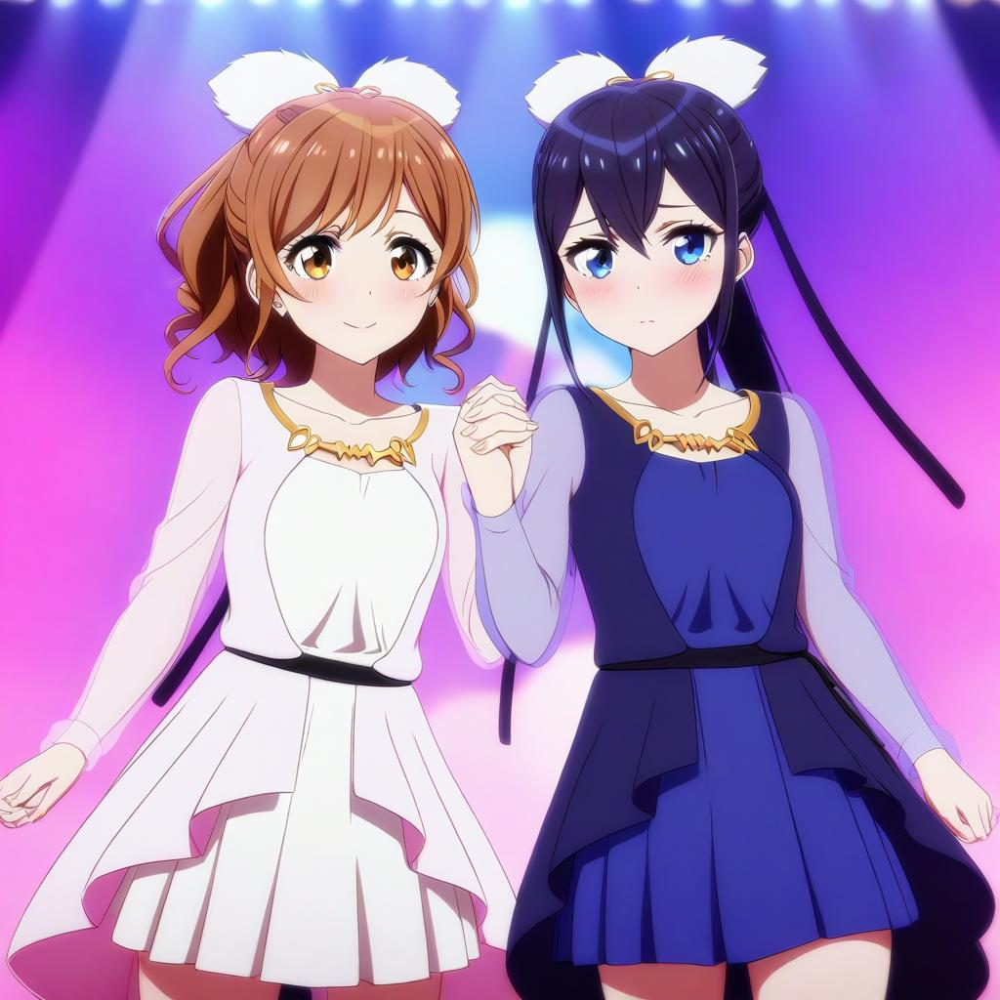

# SD Forge Attention Couple
This is an Extension for the [Forge Webui](https://github.com/lllyasviel/stable-diffusion-webui-forge), which allows you to ~~generate couples~~ target conditioning at different regions. No more color bleeds or mixed features!

> Compatible with both old & new Forge; Does **not** work with [Automatic1111 Webui](https://github.com/AUTOMATIC1111/stable-diffusion-webui)

> Supports both `SD 1` & `SDXL` but **not** `Flux`

## Showcase

- Generate the following prompt using [Juggernaut XL V7](https://civitai.com/models/133005/juggernaut-xl), with the same seed and parameters:
    ```
    a cinematic photo of 2 men arguing, indoors
    2 men, jesus christ, white robe, looking at each other, shouting
    2 men, santa claus, looking at each other, shouting
    ```

<table>
    <thead align="center">
        <tr>
            <td>Extension</td>
            <td><b>Disabled</b></td>
            <td><b>Enabled</b></td>
        </tr>
    </thead>
    <tbody align="center">
        <tr>
            <td>Result</td>
            <td><br>
            Features mixed between characters</td>
            <td><br>
            Distinct and separate characters</td>
        </tr>
    </tbody>
</table>

## How to Use

> [!NOTE]
> The effect of this Extension is dependent on the prompt-adherence capability of the Checkpoint. If the checkpoint does not understand the composition, it still cannot generate the result correctly.

> [!TIP]
> As shown in the various examples, even if a region only contains 1 subject, it's usually still better to prompt for the total amount of subjects first.

<details>
<summary><h3>Index</h3></summary>

- [Basic Mode](#basic-mode)
    - [Tile Direction](#tile-direction)
    - [Global Effect](#global-effect)
- [Advanced Mode](#advanced-mode)
- [Mask Mode](#mask-mode)
- Misc.
    - [Compatibility](#compatibility-toggle)
    - [Separator](#couple-separator)
    - [Common Prompts](#common-prompts)
    - [LoRA](#lora-support)
- [API](https://github.com/Haoming02/sd-forge-couple/wiki/API)

</details>

## Basic Mode

The **Basic** mode works by dividing the image into multiple "tiles" where each tile corresponding to one [line](#couple-separator) of the positive prompt. Therefore, simply prompt more lines if you want more regions.

<p align="center">

</p>

```
2girls, blonde twintails, cyan eyes, white serafuku, standing, waving, looking at viewer, smile
2girls, black long hair, red eyes, dark school uniform, standing, crossed arms, looking away
```

### Tile Direction

In the **Basic** mode, you can choose between whether to divie the image into columns or rows.

- **Horizontal:** First / Last line corresponds to the Left / Right region
- **Vertical:** First / Last line corresponds to the Top / Bottom region

<p align="center">
<br>
<b>Direction</b> set to <code>Vertical</code>
</p>

```
galaxy, stars, milky way
blue sky, clouds
sunrise, lens flare
ocean, waves
beach, sand
pavement, road
```

### Global Effect

In **Basic** and **Mask** modes, you can set either the **first** line or the **last** line of the positive prompt as the "background," affecting the entire image instead of just one region. Useful for specifying styles or quality tags used by **SD 1.5** and **Pony** checkpoints.

> This has **no** effect in **Advanced** mode

<br>

## Advanced Mode

Were these automated and equally-sized tiles not sufficient for your needs? Now you can manually specify each regions!

> [!IMPORTANT]
> The entire image **must** contain weight. The easiest way would be adding a region that covers the whole image *(just like **Global Effect**)*.

- **Entries:**
    - Each row contains a range for **x** axis, a range for **y** axis, a **weight**, as well as the corresponding **line** of prompt
    - The range should be within `0.0` ~ `1.0`, representing the **percentage** of the full width/height
        - **eg.** `0.0` to `1.0` would span across the entire axis
    - **x** axis is from left to right; **y** axis is from top to bottom
    - **2** *(to)* should be larger than **1** *(from)*

> [!NOTE]
> The mapping data is not sent when using the `Send to img2img` function. Click the `Pull from txt2img` to manually transfer the data.

- **Control:**
    - Click on a row to select it, highlighting its bounding box
        - Click on the same row again to deselect it
    - When a row is selected, click the `🆕` button above / below to insert a new row above / below
        - If holding `Shift`, it will also insert a newline to the prompts
    - When a row is selected, click the `❌` button to delete it
        - If holding `Shift`, it will also **delete** the corresponding line of prompt
    - Click the `Default Mapping` button to reset the mappings

- **Draggable Region:**
    - When a bounding box is highlighted, simply drag the box around to reposition the region; drag the edges / corners to resize the region

- **Background:**
    - Click the `📂` button to load a image as the background of the mapping
    - Click the `⏏` button to load the **img2img** input image as the background
    - Click the `🗑` button to clear the background

<p align="center">
<br>
Advanced Mode UI<br>
<br>
Generation Result
</p>

```
a cinematic photo of a couple, from side, outdoors
couple photo, man, black tuxedo
couple photo, woman, white dress
wedding photo, holding flower bouquet together
sunset, golden hour, lens flare
```

<br>

## Mask Mode

Were these bounding boxes still too rigid for you...? Now you can also manually draw the areas for each regions!

> [!IMPORTANT]
> The entire image **must** contain weight. The easiest way would be using the **Global Effect**.

- **Canvas:**
    - Click the **Create Empty Canvas** button to generate a blank canvas to draw on
    - Only **pure white** `(255, 255, 255)` pixels count towards the mask, other colors are simply discarded
        - This also means that other colors can function as the "eraser" for the mask
    - Click the **Save Mask** button to save the image as a <ins>new</ins> layer of masks
    - When a layer is selected:
        - Click **Load Mask** to load the mask into canvas
        - Click **Override Mask** to save the image and <ins>override</ins> the selected layer of mask
    - Click the **Reset All Masks** button to clear all the data

> [!NOTE]
> The mask data is not sent when using the `Send to img2img` function. Click the `Pull from txt2img` to manually transfer the data.

- **Entries:**
    - Each row contains a **preview** of the layer, the corresponding **line** of prompt, and the **weight** for the layer
    - Click the preview image to <ins>select</ins> the layer
    - Use the arrow buttons to quickly re-order the layers
    - Click the `❌` button to delete the layer

- **Uploads:**
    - Use the `Upload Background` to upload an image as the reference to draw masks on
        - The image will get dimmed, therefore it will **not** count towards the mask
    - Use the `Upload Mask` to upload an image as a mask that can directly be saved
        - Mainly for when you prepare the masks in external programs

> [!WARNING]
> For Classic Forge (`Gradio 3`) users, avoid pasting images. Instead manually upload or simply drag & drop the images. Using `Ctrl + V` might send the image to the Canvas, thus breaking the Extension...

<p align="center">
<br>
Mask Mode UI<br>
<br>
Generation Result
</p>

```
cinematic photo of a dungeon
glowing lit lamps
treasure chest
```

<br>

## Compatibility Toggle

When the option is enabled, this Extension will not function during the `Hires. Fix` pass to improve the compatibility with other Extensions. Has minimal impact on performance and results.

## Couple Separator

By default when the field is left empty, this Extension uses the newline character (`\n`) as the separator to determine "lines" of the prompts. You may also specify other words as the separator instead.

- To keep your custom separator in its own line, you can add `\n` before and after the word
    - **eg.** `\nMySep\n`

- Do **not** include space in the separator
    - ` ` *(left empty)*: **OK**
    - `abc` : **OK**
    - `xyz\n` : **OK**
    - `\n` : **OK**
    - `\n\n` : **OK**
    - `\n  \n` : **ERROR**

## Common Prompts

If you have multiple characters that share the same poses, expressions, or outfits, it would've been a chore to keep copying and pasting the same lines over and over again. Now, you can simplify this process via the new **Common Prompts** feature:

0. To enable, select a syntax between `{ }` or `< >` first
1. First, define an unique key *(**eg.** `cloth`)*
2. Second, follow up with a `:` *(**eg.** `cloth:`)*
3. Third, follow up with your common prompts *(**eg.** `cloth:t-shirt, jacket, jeans`)*
4. Then, surround the whole thing with your chosen brackets *(**eg.** `{cloth:t-shirt, jacket, jeans}`)*
5. Finally, you can now use the key to recall the common prompts in other lines *(**ie.** `{cloth}`)*

- **TL;DR:** If you have `{foo:bar}` in your prompt, every occurrence of `{foo}` *(and the original `{foo:bar}`)* will be replaced with `bar` during the generation

> [!IMPORTANT]
> - The key has to be unique
> - You can have multiple common prompts at the same time
> - Each bracket can only contain one key

> [!TIP]
> You can enable `Debug` to check if it is working as intended in the console

> [!NOTE]
> Might be incompatible with Extensions that process prompts *(**eg.** [sd-dynamic-prompts](https://github.com/adieyal/sd-dynamic-prompts))*

<p align="center">

</p>

```
score_9, score_8_up, score_7_up, source_anime, high quality, best quality, masterpiece, {subject:2girls}, <lora:hasunosora_pony:0.8>,
{subject}, murano sayaka, low twintails, {cloth:brown dress, white sailor collar, neckerchief, standing, arms behind back, looking at viewer, smile, blush, classroom}
{subject}, hinoshita kaho, medium hair, {cloth}
```

> This works for all **3** modes

## LoRA Support

Using multiple LoRAs in different regions is possible, though it depends on how well the LoRAs work together...

LoRA that contains multiple subjects seems to work better in my experience.

<p align="center">

</p>

```
[high quality, best quality], 2girls, on stage, backlighting, [bloom, hdr], <lora:suzurena:0.72>
2girls, miyama suzune, pink idol costume, feather hair ornament, holding hands, looking at viewer, smile, blush
2girls, hanaoi rena, blue idol costume, feather hair ornament, holding hands, looking at viewer, shy, blush
```

<br>

## API
For usage with API, please refer to the [Wiki](https://github.com/Haoming02/sd-forge-couple/wiki/API)

> [!CAUTION]
> The **Mask** mode is broken if you use the Webui with `--api` flag. So either: <br>
> - Use the Webui alone <br>
> **or** <br>
> - Use the API alone with both `--api` and `--nowebui` flags

<hr>

## TypeError: 'NoneType'

For users that get the following error:

```py
RuntimeError: shape '[X, Y, 1]' is invalid for input of size Z
shape '[X, Y, 1]' is invalid for input of size Z
*** Error completing request
    ...
    Traceback (most recent call last):
        ...
        res = list(func(*args, **kwargs))
    TypeError: 'NoneType' object is not iterable
```

1. Go to **Settings** -> **Optimizations**, and enable `Pad prompt/negative prompt`
2. Set the `Width` and `Height` to multiple of **64**

<hr>

## Special Thanks
- Credits to the original author, **[laksjdjf](https://github.com/laksjdjf)**, whose [ComfyUI Node](https://github.com/laksjdjf/cgem156-ComfyUI/tree/main/scripts/attention_couple) I used to port into Forge
- Also check out <ins>arcusmaximus</ins>'s alternative approach to [draggable-box-ui](https://github.com/arcusmaximus/sd-forge-couple/tree/draggable-box-ui)
