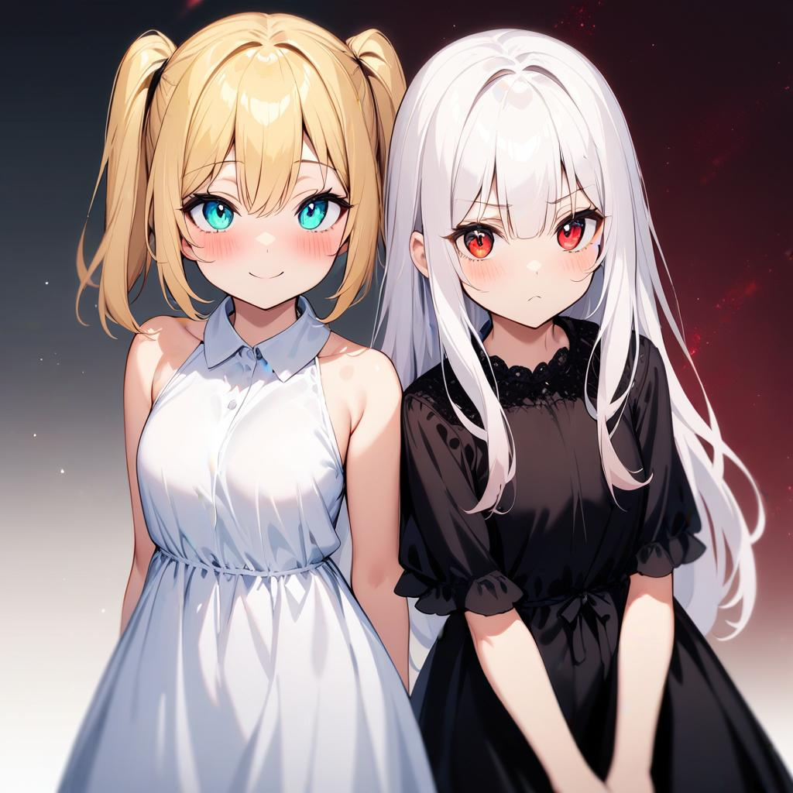
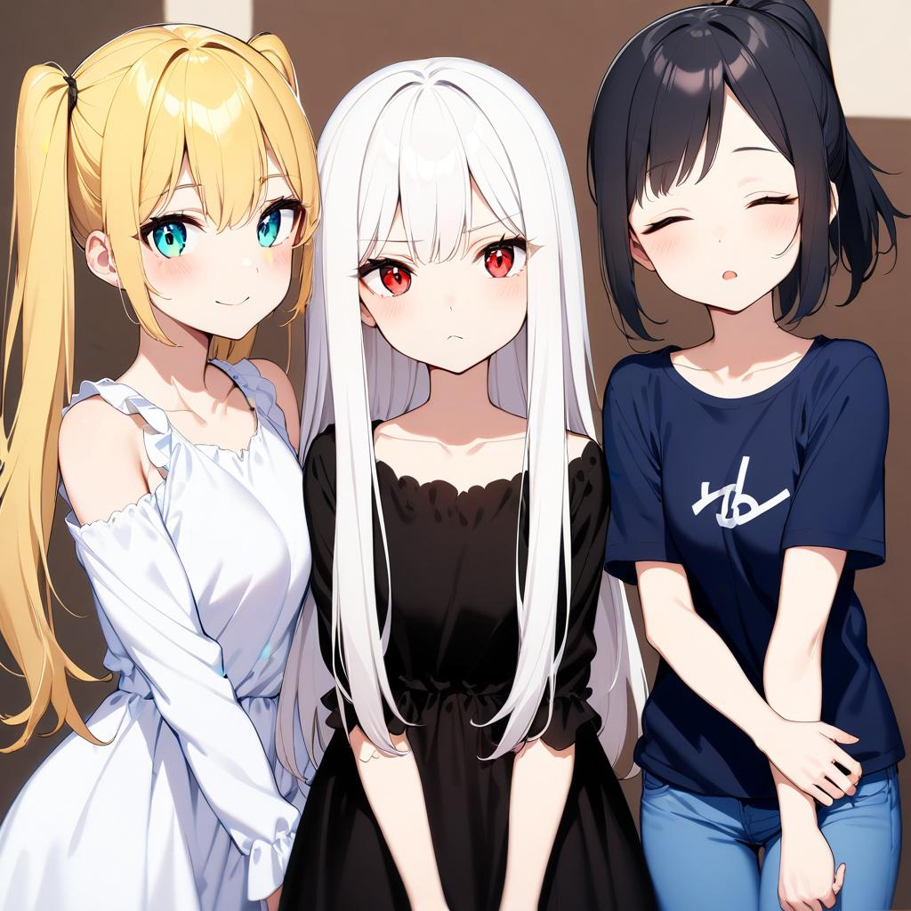
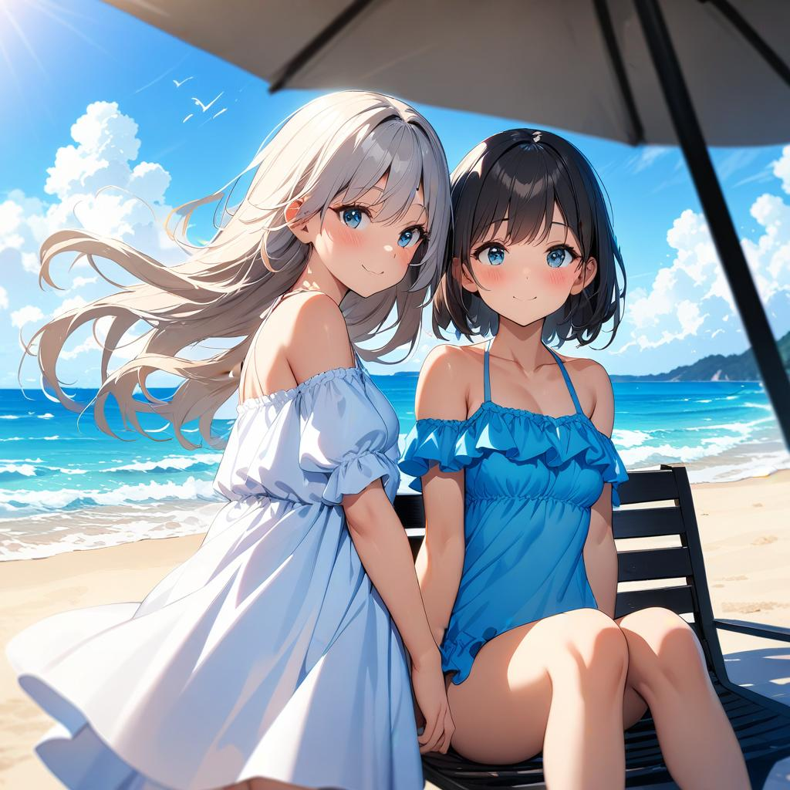
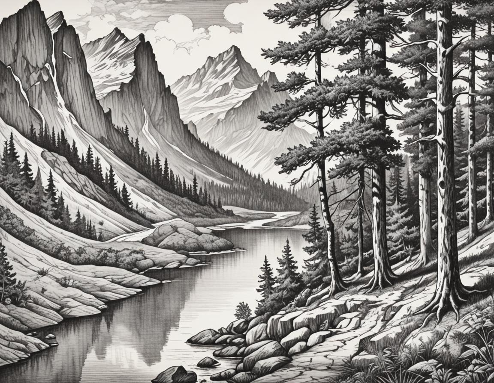
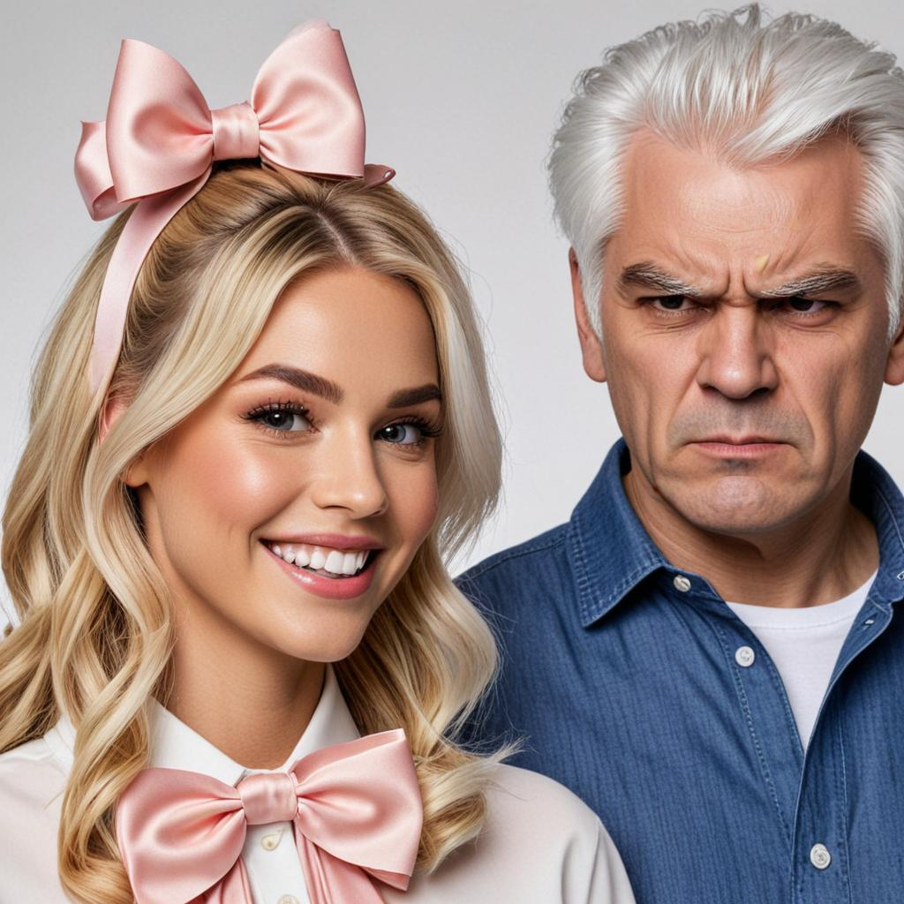
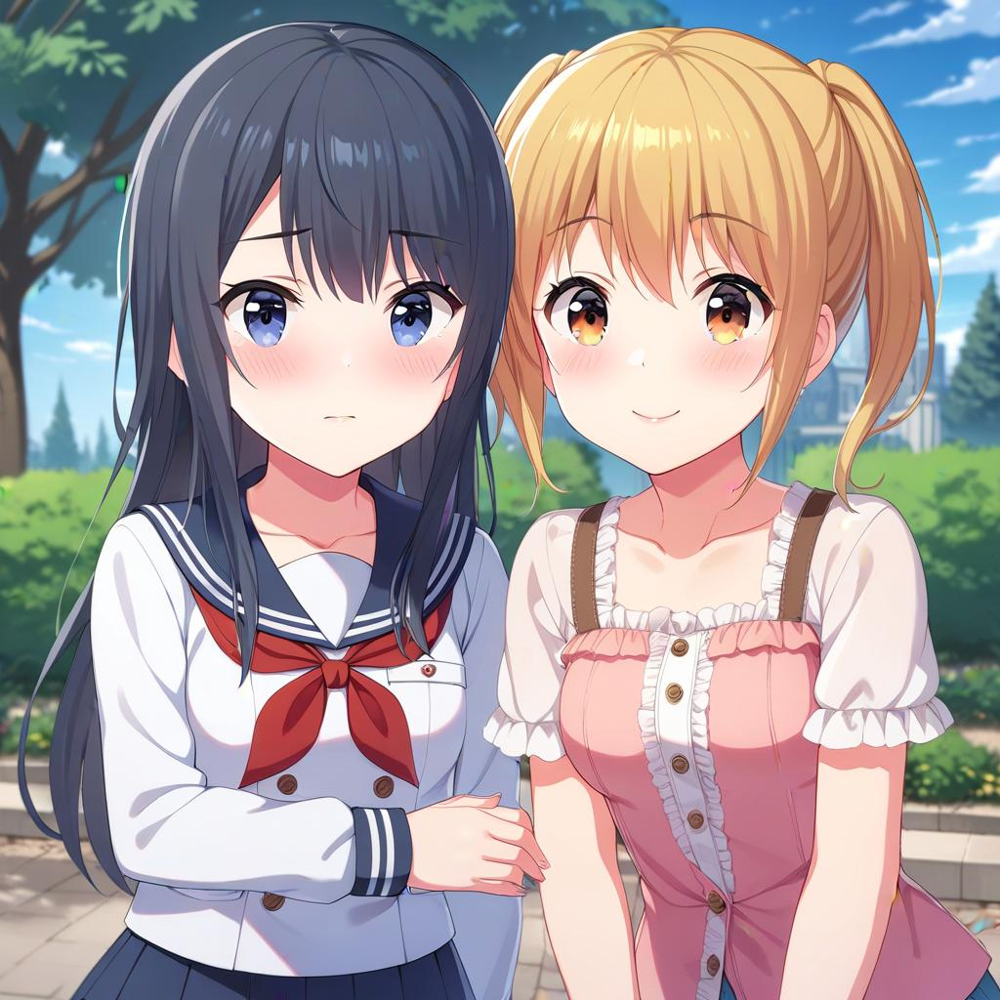
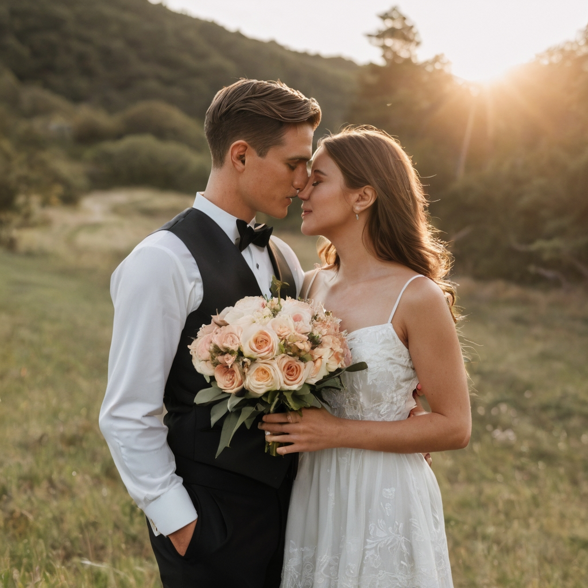
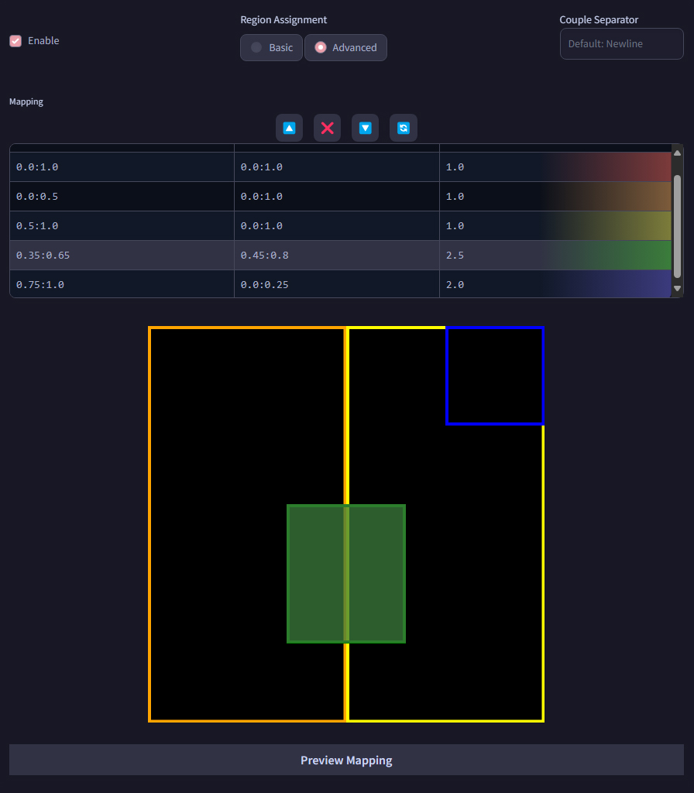

# SD Forge Attention Couple
This is an Extension for the [Forge Webui](https://github.com/lllyasviel/stable-diffusion-webui-forge), which allows you to ~~generate couples~~ target conditioning at different regions. No more color bleeds or mixed features!

> This does **not** work with [Automatic1111 Webui](https://github.com/AUTOMATIC1111/stable-diffusion-webui)

> One advantage over **Latent Couple** is that, since the conditioning only needs to be calculated once at the beginning, the actual generation speed is not affected!

> As shown in the examples below, even if a region only contains 1 subject, it's usually still better to prompt for the total amount of subjects first.

## How to Use

### Lines Parsing

This Extension works by dividing the image into multiple tiles, each corresponding to one line in the prompt. So if you want more characters, just prompt more lines! Empty lines are skipped.

<p align="center">

</p>

```
[high quality, best quality], 2girls, blonde twintails, cyan eyes, white dress, looking at viewer, smile, blush
2girls, white long hair, red eyes, black dress, looking at viewer, frown
```

<p align="center">

</p>

```
[high quality, best quality], 3girls, blonde twintails, cyan eyes, white dress, looking at viewer, smile, blush
3girls, white long hair, red eyes, black dress, looking at viewer, frown
3girls, black ponytail, closed eyes, t-shirt, jeans, looking at viewer, sleepy
```

### Tile Direction

Choose between dividing the image into columns or rows
- **Horizontal:** Tiles from left to right
- **Vertical:** Tiles from top to bottom

<p align="center">

</p>

```
[high quality, best quality], galaxy, stars, milky way
blue sky, clouds
sunrise, lens flare
ocean, waves
beach, sand
pavement, road
```

### Global Effect

Set either the **first line** or the **last line** of the **Positive** prompts to affect the entire image instead of also being divided. Useful for specifying style, quality, or background, etc. (**Negative** prompt is always global regardless of settings.)

<p align="center">

</p>

```
[high quality, best quality], (cinematic), 2girls, beach, summer, day, sky, (bloom, hdr)
2girls, white dress, standing, wind, floating hair, looking at viewer, smile, blush
2girls, frills swimsuit, sitting, chair, knees up, smile, blush
```

<p align="center">

</p>

```
a cinematic photo of 2 men arguing, indoors, court room
2 men, jesus christ, white robe, looking at each other, shouting
2 men, santa claus, looking at each other, shouting
```

<p align="center">

</p>

```
a pencil drawing of scenery
mountains
river
tree
forest
```

### Couple Separator

By default, this Extension uses newline (`\n`) as the separator between tiles. You can also specify any keyword as the separator instead.

<p align="center">
<br>
<b>Separator:</b><code>{SEP}</code>
</p>

```
a high quality photo of a man and a woman
side-by-side,
blonde hair, hair bow, smile, blush {SEP}
a man and a woman,
white hair, angry, frown
```

### LoRA Support

Using multiple LoRAs also works to a degree, depending on how well each LoRA works together...

LoRA with multiple subjects works better in my experience.

<p align="center">

</p>

```
2girls, nagase kotono, serafuku, looking at viewer, shy, blush, <lora:ktn:0.64>
2girls, kawasaki sakura, casual, looking at viewer, smile, blush, <lora:skr:0.64>
[high quality, best quality], 2girls, park, outdoors
```

<p align="center">

</p>

```
[high quality, best quality], 2girls, on stage, backlighting, [bloom, hdr], <lora:suzurena:0.72>
2girls, miyama suzune, pink idol costume, feather hair ornament, holding hands, looking at viewer, smile, blush
2girls, hanaoi rena, blue idol costume, feather hair ornament, holding hands, looking at viewer, shy, blush
```

## Advanced Mapping
Were these automated equally-sized tiles not sufficient for your needs? Now you can manually specify each regions! The mapping logic is the same: one line corresponds to one entry.

- **Notes:**
    - You **must** have values in the entire mask. Simplest way would be adding a global entry.
    - Entries with empty **x** column are skipped
        - Right now, there's no way to delete a row, so just leave the **x** column empty...

- **Regions:**
    - Each region contains a (**x**, **y**) range and a **weight**
    - The **x** and **y** are in the syntax of `from : to`
    - **x** is from left to right; **y** is from top to bottom
    - The values should be `0.0 ~ 1.0`, representing the **percentage** of the full width/height
        - **eg.** `0.0:1.0` would span across the entire axis

- **Preview:**
    - Specify a width and height for the preivew
    - Click the **Preview Mapping** button to see each region
    - Colors are mapped in the sequence of a rainbow

<p align="center">


</p>

```
a cinematic photo of a couple, from side, outdoors
couple photo, man, black tuxedo
couple photo, woman, white dress
wedding photo, holding flower bouquet together
sunset, golden hour, lens flare
```

<hr>

## Compatibility Table

<table>
    <tr><th>Feature</th><th>Example</th><th>Support</th></tr>
    <tr><td>Control Net</td><td>OpenPose</td><td>Yes</td></tr>
    <tr><td>Wildcards</td><td>__colors__</td><td>Yes</td></tr>
    <tr><td>Single LoRA</td><td>Style</td><td>Yes</td></tr>
    <tr><td>Multi-LoRA</td><td>Characters</td><td>Limited</td></tr>
    <tr><td>Prompt Scheduling</td><td>[from:to:steps]</td><td>No</td></tr>
</table>

<hr>

## TypeError: 'NoneType'

For people that get the following error:
```py
RuntimeError: shape '[X, Y, 1]' is invalid for input of size Z
shape '[X, Y, 1]' is invalid for input of size Z
*** Error completing request
    ...
    Traceback (most recent call last):
        ...
        res = list(func(*args, **kwargs))
    TypeError: 'NoneType' object is not iterable
```

1. Go to **Settings** -> **Optimizations**, and enable `Pad prompt/negative prompt`
2. Set the `Width` and `Height` to multiple of **64**

<hr>

## Special Thanks
- Credits to the original author, **[laksjdjf](https://github.com/laksjdjf)**, whose original [ComfyUI Node](https://github.com/laksjdjf/cgem156-ComfyUI/tree/main/scripts/attention_couple) I used to port into Forge
- Example images were generated with [Animagine XL V3.1](https://civitai.com/models/260267) and [juggernautXL v7](https://civitai.com/models/133005)
