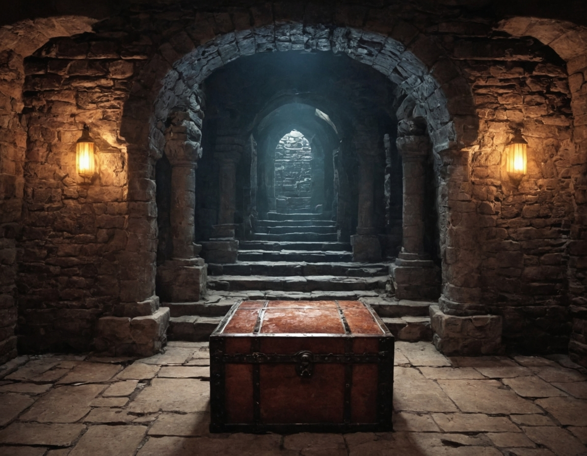
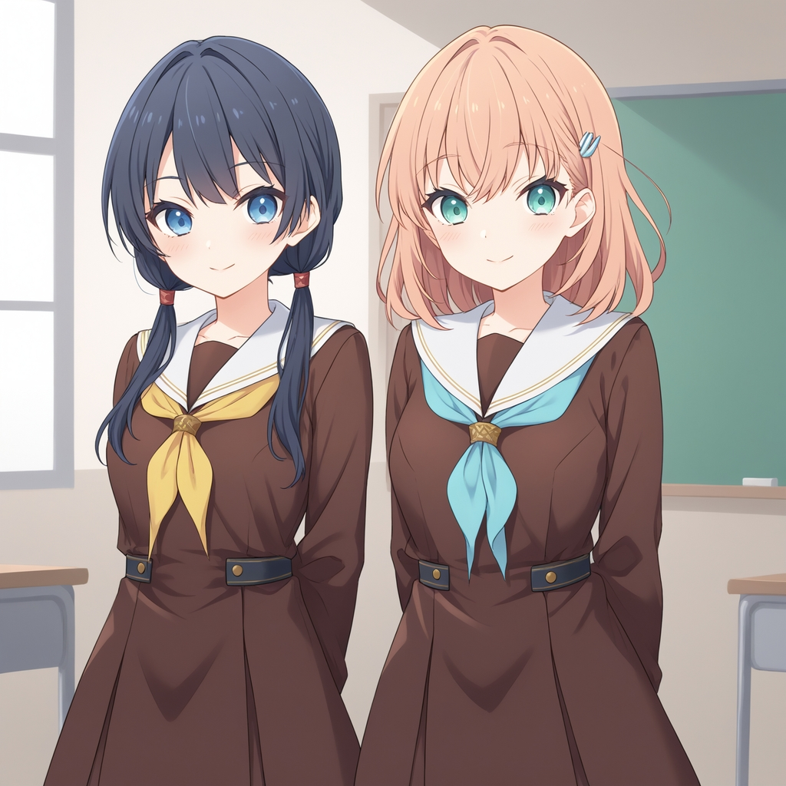

# SD Forge Attention Couple
This is an Extension for the Forge Webui, which allows you to ~~generate couples~~ target conditioning at different regions. No more color bleeds or mixed features!

> Support [Forge](https://github.com/lllyasviel/stable-diffusion-webui-forge), [reForge](https://github.com/Panchovix/stable-diffusion-webui-reForge), [Forge Classic](https://github.com/Haoming02/sd-webui-forge-classic), and [Automatic1111 Webui](https://github.com/AUTOMATIC1111/stable-diffusion-webui) [*](#unpatch) !

> Support both `SD1` & `SDXL`; but **not** `SD3` or `Flux`

## Showcase
Trying to generate "jesus christ arguing with santa claus"

<table>
    <thead align="center">
        <tr>
            <th><b>with</b> Forge Couple</th>
            <th><b>without</b> Forge Couple</th>
        </tr>
    </thead>
    <tbody align="center">
        <tr>
            <td>
            <br>Distinct and separate characters</td>
            <td>
            <br>Features mixed between characters</td>
        </tr>
    </tbody>
</table>

## How to Use

> [!IMPORTANT]
> Think of this Extension as a LLM for prompts: the defined regions are more like "suggestions" rather than strict boundaries. Don't expect the results to follow the regions with pixel-perfect precision. Additionally, the effectiveness of this Extension depends on how well the Checkpoint follows to the prompt. If the Checkpoint doesn't understand the composition, it won't generate the desired result accurately.

> [!TIP]
> As shown in the various examples, even if a region only contains 1 subject, it's usually still better to prompt for the total amount of subjects first.

<details open>
<summary><h4>Index</h4></summary>

- [Basic Mode](#basic-mode)
    - [Tile Direction](#tile-direction)
- [Advanced Mode](#advanced-mode)
- [Mask Mode](#mask-mode)
- [Misc.](#other-parameters)
    - [Global Effect](#global-effect)
    - [Compatibility](#compatibility-toggle)
    - [Separator](#couple-separator)
    - [Common Prompts](#common-prompts)
    - [LoRA](#lora-support)
- [Tile Mode](#tile-mode)
- [API](https://github.com/Haoming02/sd-forge-couple/wiki/API)
- [FAQ](#troubleshooting)

</details>

<br>

### Basic Mode

The **Basic** mode works by dividing the image into multiple "tiles" where each tile corresponds to a "**[line](#couple-separator)**" of the positive prompt. Therefore, simply prompt more lines to generate more regions.

<p align="center">

</p>

```
2girls, blonde twintails, cyan eyes, white serafuku, standing, waving, looking at viewer, smile
2girls, black long hair, red eyes, dark school uniform, standing, crossed arms, looking away
```

#### Tile Direction

In the **Basic** mode *(only)*, you can choose dividing the image into columns or rows.

- **Horizontal:** First / Last line corresponds to the Left / Right -most region
- **Vertical:** First / Last line corresponds to the Top / Bottom -most region

<p align="center">
<br>
<code>Vertical</code> <b>Direction</b>
</p>

```
galaxy, stars, milky way
blue sky, clouds
sunrise, lens flare
ocean, waves
beach, sand
pavement, road
```

<br>

### Advanced Mode

Were these automated and equally-sized tiles not sufficient for your needs? Now you can manually specify each regions!

> [!IMPORTANT]
> The entire image **must** contain weights

- **Entries:**
    - Each row contains a range for **x** axis, a range for **y** axis, a **weight**, as well as the corresponding **line** of prompt
        - **x** axis is from left to right; **y** axis is from top to bottom
    - The range should be within `0.0` ~ `1.0`, representing the **percentage** of the full width/height *(**eg.** `0.0` to `1.0` would span across the entire axis)*
    - The weight is capped at `0.0` ~ `5.0`
    - The prompt is only for quick reference; in case it went out of sync, the actual generation is still based on the prompt field

> [!NOTE]
> The mappings are not sent when using the `Send to img2img` function, click the `Pull from txt2img` to manually transfer the mappings

- **Control:**
    - Click on a row to select it, highlighting its bounding box
        - Click on the same row again to deselect it
    - When a row is selected, click the `🆕` button above / below to insert a new row above / below
        - If holding `Shift`, it will also insert a new empty line to the prompts
    - When a row is selected, click the `❌` button to delete it
        - If holding `Shift`, it will also **delete** the corresponding line of prompt
    - Click the `Default Mapping` button to reset the mappings

- **Presets:**
    - You can save the current mapping data, and load them again in the future

- **Draggable Region:**
    - When a bounding box is highlighted, simply drag the box around to reposition the region; drag the edges / corners to resize the region

- **Background:**
    - Click the `📂` button to load an image as the background of the mapping
    - Click the `⏏` button to load the **img2img** input image as the background
    - Click the `🗑` button to clear the background

<p align="center">
<br>
Advanced Mode UI
</p>

<p align="center">
<br>
Generation Result
</p>

```
a cinematic photo of a couple, from side, outdoors
couple photo, man, black tuxedo
couple photo, woman, white dress
wedding photo, holding flower bouquet together
sunset, golden hour, lens flare
```

<br>

### Mask Mode

Were these bounding boxes still too rigid for you...? Now you can also manually draw the areas for each regions!

> [!IMPORTANT]
> The entire image **must** contain weights

- **Canvas:**
    - Click the **Create Empty Canvas** button to generate a blank canvas to draw on
    - Only **pure white** `(255, 255, 255)` pixels count towards the mask, other colors are simply discarded
        - This also means you can use other colors as the "eraser"
    - Click the **Save Mask** button to save the image as a <ins>new</ins> layer of masks
    - When a layer is selected:
        - Click **Load Mask** to load the mask into canvas
        - Click **Override Mask** to save the image and <ins>override</ins> the selected layer of mask
    - Click the **Reset All Masks** button to clear all the data

> [!NOTE]
> The masks are not sent when using the `Send to img2img` function, click the `Pull from txt2img` to manually transfer the masks *(the `weights` are not sent...)*

- **Entries:**
    - Each row contains a **preview** of the layer, the corresponding **line** of prompt, and the **weight** for the layer
        - The prompt is only for quick reference; in case it went out of sync, the actual generation is still based on the prompt field
    - Click the preview image to <ins>select</ins> the layer
    - Use the arrow buttons to quickly re-order the layers
    - Click the `❌` button to delete the layer

- **Uploads:**
    - Use the `Upload Background` to upload an image as reference to draw masks on
        - The image will be darkened, thus **not** counting towards the mask
    - Use the `Upload Mask` to upload an image as a mask that can directly be saved
        - Mainly for when you prepare the masks in external programs

> [!NOTE]
> Do not draw a mask that is too small, having just a dot of conditioning doesn't do much...

> [!WARNING]
> For Forge Classic (`Gradio 3`) users, avoid pasting images. Instead manually upload or simply drag & drop the images. Using `Ctrl + V` might send the image to the Canvas, thus breaking the Extension...

<p align="center">
<br>
Mask Mode UI
</p>

<p align="center">
<br>
Generation Result
</p>

```
cinematic photo of a dungeon
glowing lit lamps
treasure chest
```

<br>

## Other Parameters
> These options are not limited to a specific mode

### Global Effect

In **Basic** and **Mask** modes *(only)*, you can set either the **first** line or the **last** line of the positive prompt as the "background," affecting the entire image instead of just one region. Useful for specifying styles or quality tags.

### Compatibility Toggle

When this is enabled, this Extension will not function during the `Hires. Fix` pass to improve the compatibility with other Extensions. *(Recommended)*

> [!IMPORTANT]
> This Extension currently does **not** support `Hires. fix` prompts...

### Couple Separator

By default when the field is left empty, this Extension uses the newline character (`\n`) as the separator to determine "lines" of the prompts. You may also specify other words as the separator instead.

> [!TIP]
> To keep the custom separator within its own line, you can add `\n` before and after the word

- <ins>Examples</ins>
    - ` ` *(left empty)*
    - `foo`
    - `\nbar\n`
    - `\n\n`

### Common Prompts

If you have multiple characters that share the same outfits, poses, or expressions, you can now simplify the process via **Common Prompts** - No more copying and pasting the same lines over and over!

0. To enable, select a syntax between `{ }` or `< >` first
1. First, define an unique key *(**eg.** `cloth`)*
2. Second, follow up with a `:` *(**eg.** `cloth:`)*
3. Third, follow up with your common prompts *(**eg.** `cloth:t-shirt, jacket, jeans`)*
4. Then, surround the whole thing with your chosen brackets *(**eg.** `{cloth:t-shirt, jacket, jeans}`)*
5. Finally, you can now use the key to recall the common prompts in other lines *(**ie.** `{cloth}`)*

- **TL;DR:** If you have `{foo:bar}` in your prompt, every occurrence of `{foo}` 
  (and optionally the original `{foo:bar}` if *Include Definitions to Prompt* is enabled) 
  will be replaced with `bar` during the generation.

> [!IMPORTANT]
> - The key has to be unique
> - You can have more than 1 common prompt at the same time
> - Each bracket can only contain one key

> [!TIP]
> You can enable `Debug` to check if it is working as intended in the console

<p align="center">

</p>

```
score_9, score_8_up, score_7_up, source_anime, high quality, best quality, masterpiece, {subject:2girls}, <lora:hasunosora_pony:0.8>,
{subject}, murano sayaka, low twintails, {cloth:brown dress, white sailor collar, neckerchief, standing, arms behind back, looking at viewer, smile, blush, classroom}
{subject}, hinoshita kaho, medium hair, {cloth}
```

### LoRA Support

LoRA that contains multiple subjects is easier to generate multiple characters. Using different LoRAs in different regions is also possible, though it depends on how well the LoRAs' concepts work together...

<br>

## Tile Mode

Trying a upscale an image to super high resolution using tiled **img2img**, while still keeping the features separated? Now you can prompt each tile based on its overlapping regions!

- **Prerequisite**
    - Some way to break the generation into tiles
        - **eg.** the built-in `SD Upscale` script
        - The tile order is assumed to be `top-left` > `top-right` > `bottom-left` > `bottom-right`
    - The input image does **not** need to have been generated with `ForgeCouple`; you can simply use any image
    - Set up the `ForgeCouple` regions like you would normally; all 3 modes are supported
    - Switch to the `Tile` tab and enable the feature
    - `ControlNet` with the `Tile` Module is highly recommended

- **Parameters**
    - **Inclusion Threshold** controls how much overlap between the tile and the region is needed for the corresponding prompt to be included
        - Prevents adding the prompts from regions barely touching the tile
        - `0.0` means every single line of prompt would be included; `1.0` means the region and the tile have to perfectly match to be counted
    - **Tile Count** refers to the amount of tiles needed
        - The values are based on your tiling parameters, not arbitrary
    - **Subject Replacement** is used to replace the original "total amount of subjects" with singular subject, in order to prevent generating extra characters within a tile
        - Each line is a `key: values` pair
        - The `key` is the prompt to use
        - The `values` are the tags to be replaced, separated by comma
        - *(Alternatively, you can just modify the original prompts and ignore this field)*
    - You may enable **Debug Tiles** to check if the prompts are assigned correctly

<p align="center">
<br>
Tile Mode UI
</p>

- **Example**

0. Generate an image in **txt2img**
    - **Forge Couple:** `Basic` mode; `First Line` background
    - **Resolution:** `1024` x `1024`
    - **Prompt:**
    ```
    masterpiece, best quality, high quality,
    2girls, hatsune miku, back-to-back,
    2girls, kagamine rin, back-to-back
    ```

<p align="center">

</p>

1. Send to **img2img**, keeping the same `ForgeCouple` parameters
2. Enable the `SD Upscale` script
    - **Scale Factor:** `1`
    - **Upscaler:** `Nearest`
    - **Tile Overlap:** `32`
3. Adjust the resolution
    - **Width:** `576`
    - **Height:** `1024`

> Meaning, this will generate **2x1** tiles

4. Switch to the `Tile` tab
5. Enable and set up the `Tile` mode
    - **Threshold:** `0.75`
    - **H. Tile:** `2`; **V. Tile:** `1`
    - **Replacement:**
    ```
    1girl: 2girls
    : back-to-back
    ```

6. Generate
7. ...
8. Profit !

<p align="center">

</p>

In this example, it would generate **2** tiles in total, with the left side using:
```
masterpiece, best quality, high quality,
1girl, hatsune miku
```
as the prompt; while the right side uses:
```
masterpiece, best quality, high quality,
1girl, kagamine rin
```

> [!Tip]
> Both **Global Effect** and **Common Prompts** also work with `Tile` mode

<br>

## API
For usages with API, please refer to the [Wiki](https://github.com/Haoming02/sd-forge-couple/wiki/API)

<br>

## Troubleshooting
> **F**requently **A**sked **Q**uestions

- **Generation gets interrupted at 1st step**
    - In `Forge`, when raising an Error from an Extension, it only gets caught while the generation continues, leading to `ForgeCouple` failing "silently." To work around this, `ForgeCouple` now interrupts the generation when an error occurs. Check the Console logs to see what went wrong...
    - *(you could disable this behavior in the settings)*

- **Not Enough Lines in Prompt**
    - In **Basic** mode, you need at least **2** lines of prompts for it to tile; **3** in case you enable **Global Effect**

- **Number of Couples and Masks mismatched**
    - Similarly, the number of lines in prompts should match the number of regions defined in **Advanced** and **Mask** modes

> [!IMPORTANT]
> Empty lines are still counted; ensure you do not leave an empty line at the end; if you want to have an empty line between each region for clarity, adjust the **Couple Separator**

- **Image must contain weights on all pixels**
    - As mentioned in [Advanced](#advanced-mode) and [Mask](#mask-mode), the entire image must contain weights. This error occurs when you didn't fill the whole image. The easiest way to achieve this:
        - **Advanced:** Create a layer that covers the entire image *(**ie.** `0.0, 1.0, 0.0, 1.0`)*
        - **Mask:** Use the **Global Effect**

- **Incompatible Extension**
    - Certain Extensions, such as [sd-dynamic-prompts](https://github.com/adieyal/sd-dynamic-prompts), will also process the prompts before/during generation. These may break the **Couple Separator** and/or **Common Prompts** as a result.

### TypeError: 'NoneType'

For users that get the following error:

```py
RuntimeError: shape '[X, Y, 1]' is invalid for input of size Z
shape '[X, Y, 1]' is invalid for input of size Z
*** Error completing request
    ...
    Traceback (most recent call last):
        ...
        res = list(func(*args, **kwargs))
    TypeError: 'NoneType' object is not iterable
```

1. Go to **Settings** -> **Optimizations**, and enable `Pad prompt/negative prompt`
2. Set the `Width` and `Height` to multiple of **64**

### Unpatch

For **Automatic1111**, this Extension adds a patch before the generation starts, then remove the patch once the generation finishes. However, if an error occurred during the generation, the `postprocess` function is not called, causing the patches to be left in and thus affecting all future generations. When this happens, click the `🩹` button to manually remove the old patches.

<hr>

## Special Thanks
- Credits to the original author, **[laksjdjf](https://github.com/laksjdjf)**, whose [ComfyUI Node](https://github.com/laksjdjf/cgem156-ComfyUI/tree/main/scripts/attention_couple) I referenced to port into Forge
