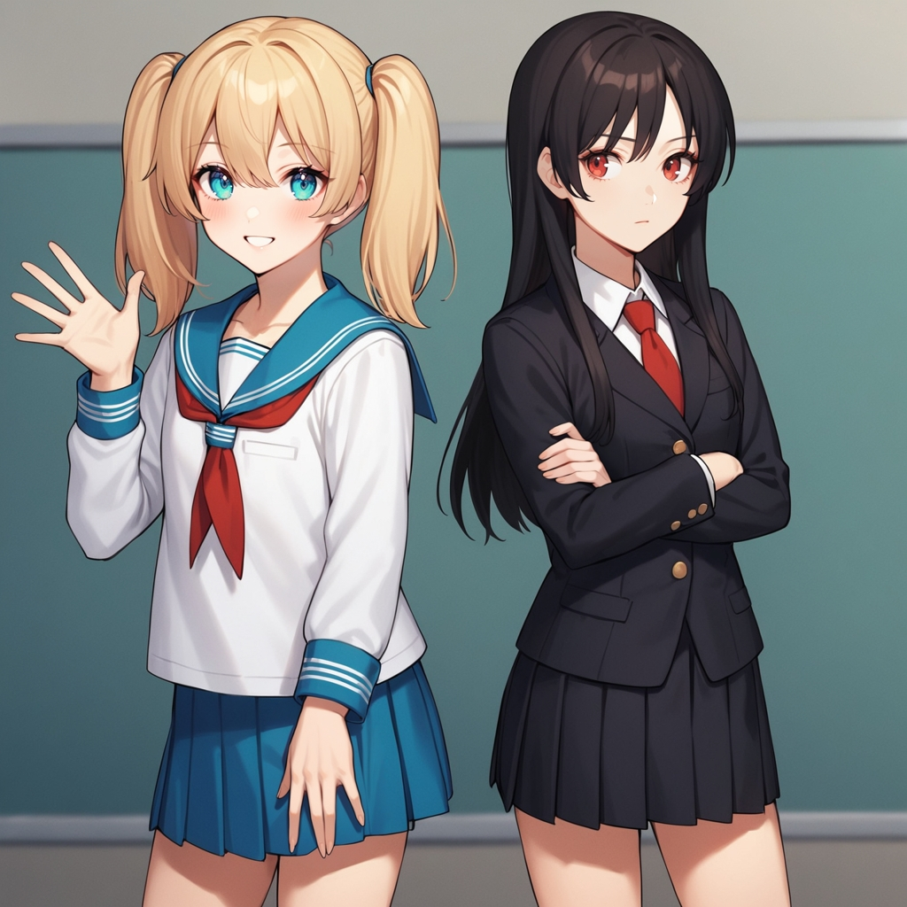

# SD Forge Attention Couple
This is an Extension for the [Forge Webui](https://github.com/lllyasviel/stable-diffusion-webui-forge), which allows you to ~~generate couples~~ target conditioning at different regions. No more color bleeds or mixed features!

> This does **not** work with [Automatic1111 Webui](https://github.com/AUTOMATIC1111/stable-diffusion-webui)

> One advantage over **Latent Couple** is that, since the conditioning only needs to be calculated once at the beginning, the actual generation speed is not affected!

> Right now all regions are automated. Manually defined regions may be added in the future...

> As shown in the examples below, even if a region only contains 1 subject, it's usually still better to prompt for the total amount of subjects first...

## How to Use

- <ins>**Lines Parsing**</ins>

This Extension works by dividing the image into multiple tiles, each corresponding to one line in the prompt. So if you want more characters, just prompt more lines! Empty lines are skipped.

<p align="center">
<br>
</p>

```
[high quality, best quality], 2girls, blonde twintails, cyan eyes, white dress, looking at viewer, smile, blush
2girls, white long hair, red eyes, black dress, looking at viewer, frown
```

<p align="center">
<br>
</p>

```
[high quality, best quality], 3girls, blonde twintails, cyan eyes, white dress, looking at viewer, smile, blush

3girls, white long hair, red eyes, black dress, looking at viewer, frown

3girls, black ponytail, closed eyes, t-shirt, jeans, looking at viewer, sleepy
```

<p align="center">
<br>
</p>

```
[high quality, best quality], 4girls, blonde twintails, cyan eyes, white dress, looking at viewer, smile, blush
4girls, white long hair, red eyes, black dress, looking at viewer, frown
4girls, black ponytail, closed eyes, white t-shirt, jeans, looking at viewer, sleepy
4girls, red bob cut, green eyes, one eye closed, wink crop tops, shorts, looking at viewer, tongue, :q
```

- <ins>**Tile Direction**</ins>

Choose between dividing the image into columns or rows

<p align="center">
<br>
</p>

```
[high quality, best quality], galaxy, stars, milky way
blue sky, clouds
sunrise, lens flare
ocean, waves
beach, sand
pavement, road
```

- <ins>**Global Effect**</ins>

Set either the **first line** or the **last line** to affect the entire image instead of also being divided. Useful for specifying style, quality, or background, etc.

<p align="center">
<br>
</p>

```
[high quality, best quality], (cinematic), 2girls, beach, summer, day, sky, (bloom, hdr)
2girls, white dress, standing, wind, floating hair, looking at viewer, smile, blush
2girls, frills swimsuit, sitting, chair, knees up, smile, blush
```

- <ins>**LoRA Support**</ins>

Using multiple LoRAs also works to a degree, depending on how well each LoRA works together...

LoRA with multiple subjects works better in my experience.

<p align="center">
<br>
</p>

```
2girls, nagase kotono, serafuku, looking at viewer, shy, blush, <lora:ktn:0.64>
2girls, kawasaki sakura, casual, looking at viewer, smile, blush, <lora:skr:0.64>
[high quality, best quality], 2girls, park, outdoors
```

<p align="center">
<br>
</p>

```
[high quality, best quality], 2girls, on stage, backlighting, [bloom, hdr], <lora:suzurena:0.72>
2girls, miyama suzune, pink idol costume, feather hair ornament, holding hands, looking at viewer, smile, blush
2girls, hanaoi rena, blue idol costume, feather hair ornament, holding hands, looking at viewer, shy, blush
```

<hr>

## Special Thanks
- Credits to the original author, **[laksjdjf](https://github.com/laksjdjf)**, whose original [ComfyUI Node](https://github.com/laksjdjf/cgem156-ComfyUI/tree/main/scripts/attention_couple) I used to port into Forge
- Example images were generated with [Animagine XL V3.1](https://civitai.com/models/260267)
