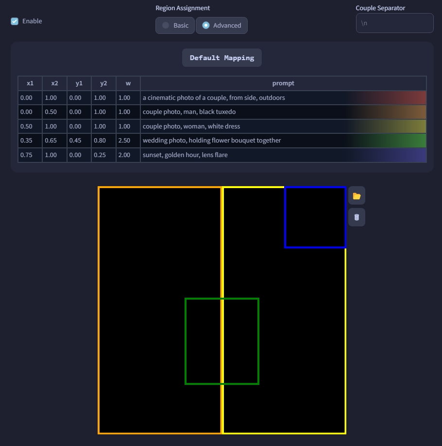

# SD Forge Attention Couple
This is an Extension for the [Forge Webui](https://github.com/lllyasviel/stable-diffusion-webui-forge), which allows you to ~~generate couples~~ target conditioning at different regions. No more color bleeds or mixed features!

> Compatible with both old & new Forge

> Supports **SD 1.5** and **SDXL** checkpoints, but not **Flux**...

> Does **not** work with [Automatic1111 Webui](https://github.com/AUTOMATIC1111/stable-diffusion-webui)

## How to Use

> As shown in the examples below, even if a region only contains 1 subject, it usually works better to prompt for the total amount of subjects first.

The default **Basic** mode works by dividing the image into multiple "tiles," each corresponding to one <ins>line</ins> in the prompt. So if you want more regions, just prompt more lines.

<p align="center">

</p>

```
2girls, blonde twintails, cyan eyes, white serafuku, standing, waving, looking at viewer, smile
2girls, black long hair, red eyes, dark school uniform, standing, crossed arms, looking away
```

### Tile Direction

In the **Basic** mode, you can also choose between dividing the image into columns or rows.

- **Horizontal:** First / Last line corresponds to the Left / Right region
- **Vertical:** First / Last line corresponds to the Top / Bottom region

<p align="center">
<br>
<b>Direction:</b><code>Vertical</code>
</p>

```
galaxy, stars, milky way
blue sky, clouds
sunrise, lens flare
ocean, waves
beach, sand
pavement, road
```

### Global Effect

In the **Basic** mode, you can set either the **first line** or the **last line** of the **positive** prompt as the "background," affecting the entire image instead of just one region. Useful for specifying styles or quality tags used by **SD 1.5** and **Pony** checkpoints.

<p align="center">
<b><i>(examples using the same seed)</i></b><br>

 <br>
<b>extension:</b> <code>off</code> | <b>extension:</b> <code>on</code>
</p>

```
a cinematic photo of 2 men arguing, indoors, court room
2 men, jesus christ, white robe, looking at each other, shouting
2 men, santa claus, looking at each other, shouting
```

### Couple Separator

By default when the field is left empty, this Extension uses newline (`\n`) as the separator to determine "lines" of the prompts. You can also specify any word as the separator instead.

### LoRA Support

Using multiple LoRAs is possible, though it depends on how well each LoRA works together...

LoRAs containing multiple subjects works easier and better in my experience.

<p align="center">

</p>

```
[high quality, best quality], 2girls, on stage, backlighting, [bloom, hdr], <lora:suzurena:0.72>
2girls, miyama suzune, pink idol costume, feather hair ornament, holding hands, looking at viewer, smile, blush
2girls, hanaoi rena, blue idol costume, feather hair ornament, holding hands, looking at viewer, shy, blush
```

<br>

## Advanced Mapping

Were these automated and equally-sized tiles not sufficient for your needs? Now you can manually specify each regions!

> **Important:** The entire image **must** contain weight. The easiest way would be adding a region that covers the whole image *(like the **Global Effect** in **Basic**)*

- **Entries:**
    - Each row contains a range for **x** axis, a range for **y** axis, a **weight**, as well as the corresponding **line** of prompt
    - The range should be within `0.0` ~ `1.0`, representing the **percentage** of the full width/height
        - **eg.** `0.0` to `1.0` would span across the entire axis
    - **x** axis is from left to right; **y** axis is from top to bottom
    - **2** *(to)* should be larger than **1** *(from)*

- **Control:**
    - Click on a row to select it, highlighting its bounding box
    - Click on the same row again to deselect it
    - When a row is selected, click the `🆕` button above / below to insert a new row above / below
        - If holding `Shift`, it will insert a newline to the prompts as well
    - When a row is selected, click the `❌` button to delete it
        - If holding `Shift`, it will **delete** the corresponding line of prompt
    - Click the `Default Mapping` button to reset the mappings

- **Draggable Region:**
    - When a bounding box is highlighted, simply drag the box around to reposition the region; drag the edges / corners to resize the region

- **Background:**
    - Click the `📂` button to load a image as the background of the mapping
    - Click the `⏏` button to load the **img2img** input image as the background
    - Click the `🗑` button to clear the background

<p align="center">


</p>

```
a cinematic photo of a couple, from side, outdoors
couple photo, man, black tuxedo
couple photo, woman, white dress
wedding photo, holding flower bouquet together
sunset, golden hour, lens flare
```

<br>

## API
For usage with API, please refer to the [Wiki](https://github.com/Haoming02/sd-forge-couple/wiki/API)

<hr>

## TypeError: 'NoneType'

For people that get the following error:
```py
RuntimeError: shape '[X, Y, 1]' is invalid for input of size Z
shape '[X, Y, 1]' is invalid for input of size Z
*** Error completing request
    ...
    Traceback (most recent call last):
        ...
        res = list(func(*args, **kwargs))
    TypeError: 'NoneType' object is not iterable
```

1. Go to **Settings** -> **Optimizations**, and enable `Pad prompt/negative prompt`
2. Set the `Width` and `Height` to multiple of **64**

<hr>

## Special Thanks
- Credits to the original author, **[laksjdjf](https://github.com/laksjdjf)**, whose [ComfyUI Node](https://github.com/laksjdjf/cgem156-ComfyUI/tree/main/scripts/attention_couple) I used to port into Forge
- Also check out <ins>arcusmaximus</ins>'s alternative approach to [draggable-box-ui](https://github.com/arcusmaximus/sd-forge-couple/tree/draggable-box-ui)
